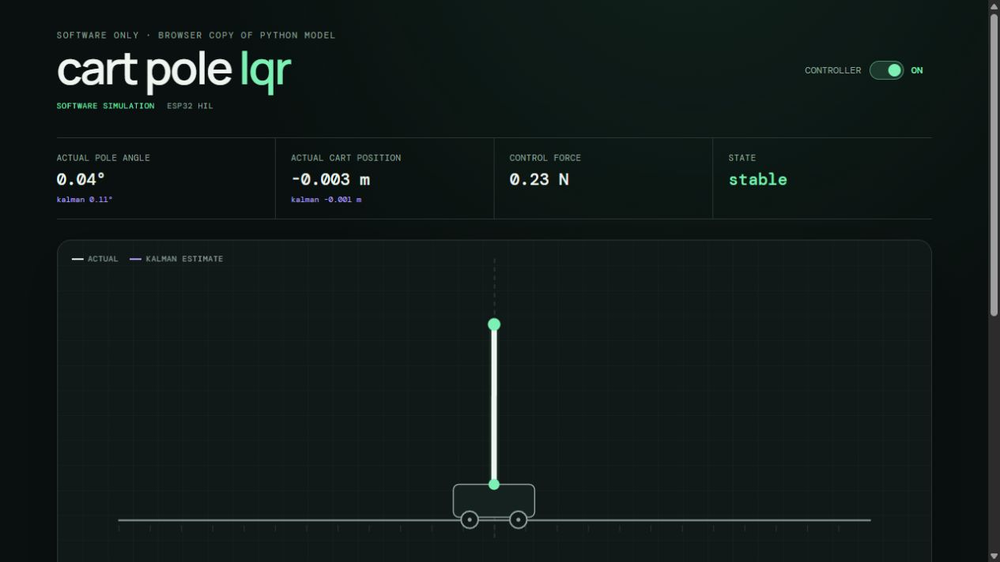
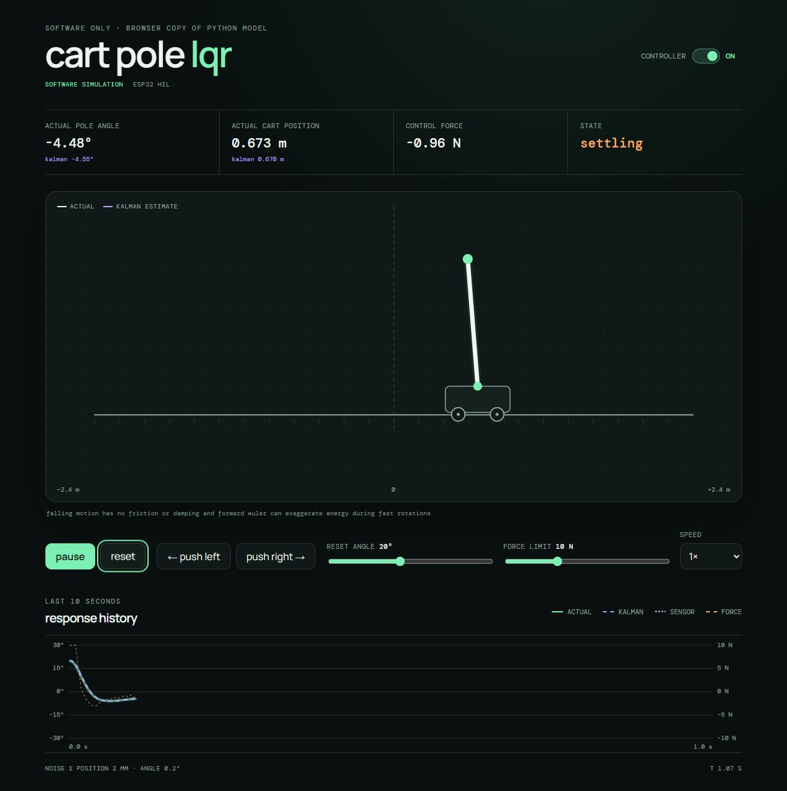

# ESP32 hardware-in-the-loop cart-pole

A nonlinear cart-pole plant simulated on a computer and stabilized by an LQR controller running on an ESP32. The ESP32 only receives noisy cart position and pole angle measurements. It uses a discrete Kalman filter to estimate the complete state, calculates the control force, limits it to the available actuator force, and sends it back to the simulated plant.

This is a small controls and embedded systems project built to follow the full path from a nonlinear model to hardware-in-the-loop validation.

> Python simulates reality while the ESP32 only sees noisy sensors. Disconnecting the ESP32 removes the estimator and controller from the HIL loop.



## Why I started this project

I started this project to learn how the main parts of a modern control system fit together in practice. I wanted to go beyond applying an LQR function to an existing simulation, so I worked through the nonlinear dynamics, linearization, controllability, state feedback, noisy measurements, Kalman estimation, and embedded implementation as separate steps.

The ESP32 HIL stage gave the project a practical goal. It required the controller and estimator to work outside Python, communicate through a simple serial protocol, and control a nonlinear plant without access to its true state. The purpose was not to create a complete physical cart-pole, but to develop a clearer understanding of control theory by building and testing the full loop.

## How it works

```text
python nonlinear plant
        |
        | noisy position and angle
        | MEAS,p,theta
        v
      esp32
  kalman filter
        |
        | estimated full state
        v
   lqr controller
        |
        | saturated force
        | DATA,p_hat,pdot_hat,theta_hat,thetadot_hat,u
        v
python applies force and advances the plant
```

Each iteration follows

$$x_k \rightarrow y_k \rightarrow \hat{x}_k \rightarrow u_k \rightarrow x_{k+1}$$

The ESP32 stores the previous force because $u_{k-1}$ is the input used to predict the state that produced the next measurement.

## Model

The state and input are

$$
x = \begin{bmatrix}p & \dot p & \theta & \dot\theta\end{bmatrix}^T,
\qquad u = F
$$

where $p$ is cart position and $\theta = 0$ is upright.

| parameter | value |
| --- | ---: |
| cart mass $M$ | 1.0 kg |
| pole mass $m$ | 0.1 kg |
| pole length $l$ | 0.5 m |
| gravity $g$ | 9.81 m/s² |
| timestep $dt$ | 0.01 s |

The nonlinear plant is described by

$$
\ddot{p} =
\frac{
F - mg\sin(\theta)\cos(\theta)
{}+ ml\dot{\theta}^{2}\sin(\theta)
}{
M + m - m\cos^{2}(\theta)
}
$$

and

$$
\ddot{\theta} =
\frac{
g\sin(\theta) - \ddot{p}\cos(\theta)
}{
l
}.
$$

The state is advanced with forward Euler integration:

$$
x_{k+1} = x_k + \dot{x}_k\Delta t.
$$

The control model is linearized around the unstable upright equilibrium:

$$
A = \begin{bmatrix}
0&1&0&0\\
0&0&-mg/M&0\\
0&0&0&1\\
0&0&(M+m)g/(Ml)&0
\end{bmatrix},
\qquad
B = \begin{bmatrix}
0\\
1/M\\
0\\
-1/(Ml)
\end{bmatrix}
$$

The controllability matrix has rank 4, so the linearized system is fully controllable.

## LQR controller

The controller was designed with

$$Q = \mathrm{diag}(1,\ 0.1,\ 100,\ 1), \qquad R = 0.1$$

The high angle weight prioritizes keeping the pole upright. The resulting gain is

$$K = \begin{bmatrix}-3.16227766 & -5.5397091 & -56.84055809 & -10.86364348\end{bmatrix}$$

Control uses the estimated state rather than the hidden true simulation state:

$$u = -K\hat{x}, \qquad -10\text{ N} \leq u \leq 10\text{ N}$$

## simulated sensors and kalman filter

Only position and angle are measured:

$$
y = \begin{bmatrix}
p\\
\theta
\end{bmatrix} + v,
\qquad
C = \begin{bmatrix}
1&0&0&0\\
0&0&1&0
\end{bmatrix}
$$

The simulated measurement noise has standard deviations of 2 mm for position and 0.2 degrees for angle. Cart velocity and pole angular velocity are never measured directly and must be reconstructed by the Kalman filter.

The continuous linear model is discretized with SciPy. The estimator uses

$$
Q_K = \mathrm{diag}(10^{-6},\ 10^{-4},\ 10^{-6},\ 10^{-4})
$$

and

$$
R_K = \begin{bmatrix}
4\times10^{-6} & 0\\
0 & 1.21846968\times10^{-5}
\end{bmatrix}.
$$

These discrete matrices, the covariances, and the LQR gain are hardcoded on the ESP32. The microcontroller performs the estimator and controller calculations but does not redesign them at runtime.

## Results

For a 5 degree initial angle and a 10 N force limit, the HIL controller stabilized the nonlinear plant with the following recorded results:

| result | value |
| --- | ---: |
| settling time (absolute pole angle remains below 0.5°) | 1.06 s |
| maximum cart position | 0.113 m |
| maximum pole angle | 5.00 degrees |
| maximum control force | 8.84 N |

The estimator was also compared with the NumPy reference using the same measurements and initial state. The implementations followed the same trajectory without divergence. The largest recorded difference was approximately $1.05\times10^{-4}$ in estimated angular velocity, consistent with the ESP32 using 32-bit floats and values crossing serial with limited precision.

Additional experiments showed:

- 37.5 degrees recovered with a 10 N force limit while 40 degrees became unstable
- 20 degrees recovered with a 5 N force limit
- with a 2 N limit, 5° recovered while 10°, 15°, and 20° did not
- the closed loop recovered from an unmodeled external force applied to the nonlinear plant

These are empirical results for this model, tuning, timestep, actuator limit, and noise. They are not universal LQR stability boundaries.

## Running the project

### Python setup

From the repository root:

```bash
python -m venv .venv
.venv\Scripts\activate
pip install -r requirements.txt
```

The individual experiments can then be run as modules. For example:

```bash
python -m src.python.experiments.kalman_estimation
python -m src.python.experiments.lqr_stabilization
```

### ESP32 HIL with python

1. Connect an ESP32 and upload `src/main.cpp` with PlatformIO.
2. Set `PORT` near the top of `src/python/experiments/esp32_control.py` to the ESP32 serial port.
3. Close any serial monitor using that port.
4. Run:

```bash
python -m src.python.experiments.esp32_control
```

The serial connection runs at 115200 baud. Python sends one `MEAS` line and waits for exactly one `DATA` response before advancing the plant.

### Interactive animation

The [`animation`](animation) folder contains two browser views:

- `index.html` is a software-only copy of the plant, Kalman filter, and controller for easy exploration
- `esp32.html` simulates only the nonlinear plant and noisy sensors in the browser while the connected ESP32 performs the Kalman and LQR calculations

Serve the repository locally:

```bash
python -m http.server 8000
```

Then open [http://localhost:8000/animation/](http://localhost:8000/animation/) for the software version or [http://localhost:8000/animation/esp32.html](http://localhost:8000/animation/esp32.html) for HIL. Web Serial requires a desktop Chromium-based browser such as Chrome or Edge.



*The image above shows the software-only visualization during recovery from a 20 degree initial angle. The separate ESP32 HIL view uses the same plant display, but receives the state estimate and control force from the connected microcontroller.*

## Repository structure

```text
src/main.cpp
    esp32 kalman filter lqr controller and serial protocol

src/python/cartpole.py
    nonlinear cart-pole dynamics

src/python/linear_model.py
    linearized state-space model and controllability check

src/python/lqr.py
    lqr design and gain calculation

src/python/kalman.py
    python reference kalman filter

src/python/experiments/
    open-loop lqr sensor kalman comparison and hil experiments

animation/
    software and esp32 hil browser visualizations
```

## Limitations

- LQR is a local stabilizing controller around the upright equilibrium and there is no swing-up controller
- the mechanical plant is simulated rather than physical
- the simulation does not include detailed motor dynamics, friction, backlash, encoder behavior, or structural flex
- the plant uses forward Euler integration at 0.01 seconds
- communication is a lockstep USB serial exchange rather than a hard real-time physical control loop
- the actuator is modeled as simple force saturation
- sensor noise is independent Gaussian noise without bias or drift

These limitations define the intended scope: a compact HIL controls project focused on modeling, state estimation, embedded feedback, and validation.

## Documentation and authorship note

This README was generated by ChatGPT 5.6 Sol Medium based on notes from conversations between me and GPT-5.6. I used these conversations to question my ideas, organize the project, and improve how the work is explained. The project itself was carried out as a learning exercise, with the aim of understanding the methods rather than only producing a finished demonstration.

The browser animation in [`animation`](animation) was implemented solely by Codex GPT-5.6 Medium from my requirements and iterative feedback. I do not claim to have written that part of the project.
